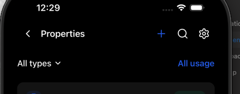
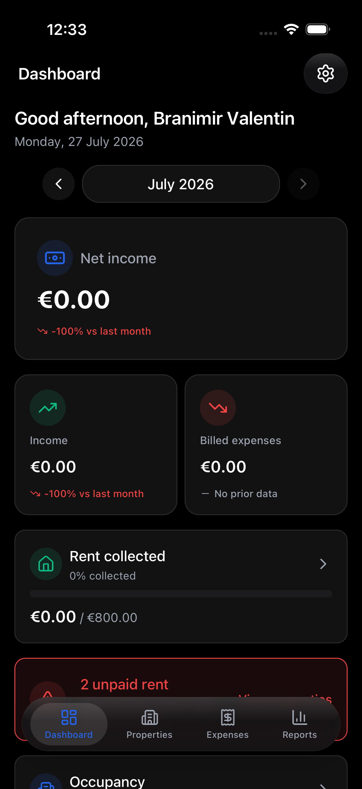
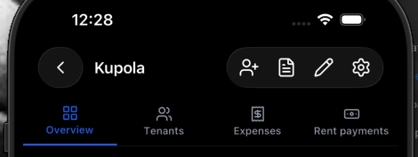

# Navigation chrome — before vs after

Side-by-side reference for aligning **tab roots**, **entity push**, and **property sub-tabs**.

## Tab roots (Properties)

| Before | After (dark) |
|--------|----------------|
| Flat header; + / search / settings **without** glass pill | Glass pill with same Lucide icons (+ / search / settings) |
|  | *Capture:* `tab-root-properties.png` after opening Properties tab |

**After (dashboard tab root)** — settings in glass pill:



## Entity push (Property detail)

| Before | After (dark) |
|--------|----------------|
| Glass back circle + glass action pill | Same via shared `GlassSurface` + `HeaderActionsPill` |
|  | *Capture:* `entity-push-property-detail.png` from property detail |

## Property sub-tabs

Capture four frames on property `[id]` (Overview, Tenants, Expenses, Rent). Sub-tab bar layout unchanged (underline); tab icons aligned to **20px** like the bottom glass tab bar.

## Dev helper

In development builds: open `/dev/nav-audit` to jump between routes for screenshots.

```bash
# Example deep link (may show system “Open in StanApp” on some URLs)
xcrun simctl openurl booted "stanapp://dev/nav-audit"
```
